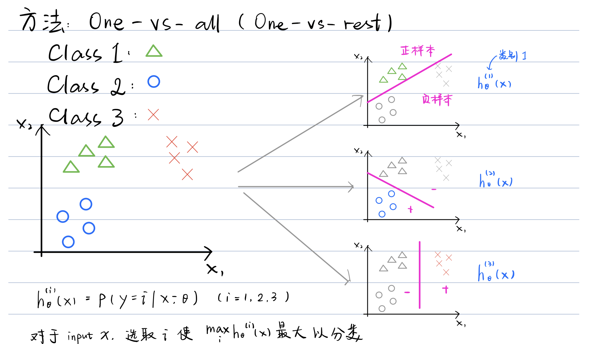

# Classification

## Binary Classification

To attempt classification, 
one method is to use **linear regression** and map all predictions greater than 0.5 as a 1 and all less than 0.5 as a 0. 

However, this method doesn't work well because **classification is not actually a linear function**.

The classification problem is just like the regression problem, 
except that the values we now want to predict take on only a small number of discrete values. 

For now, we will focus on the **binary classification problem** in which y can take on only two values,
0 and 1. 

(Most of what we say here will also generalize to(推广到) the multiple-class case.) 

For instance, if we are trying to build a spam classifier for email, then $x^{(i)}$ may be some features of a piece of email, 
and y may be 1 if it is a piece of spam mail, and 0 otherwise. 

Hence(因此), y∈{0,1}. 0 is also called the **negative class**, and 1 the **positive class**, 
and they are sometimes also denoted by the symbols “-” and “+.” 

Given $x^{(i)}$, the corresponding $y^{(i)}$ is also called the label for the training example.

---

## Multiclass Classification: One-vs-all

Now we will approach the classification of data when we have **more than two categories**. 

Instead of y = {0,1} we will expand our definition so that y = {0,1...n}.

Since y = {0,1...n}, 
we divide our problem into n+1 (+1 because the index starts at 0) binary classification problems; 

in each one, we predict the probability that 'y' is a member of one of our classes.

$y \in\{0,1 \ldots n\}$

$h_{\theta}^{(0)}(x)=P(y=0 \mid x ; \theta)$

$h_{\theta}^{(1)}(x)=P(y=1 \mid x ; \theta)$

$\cdots$

$h_{\theta}^{(n)}(x)=P(y=n \mid x ; \theta)$

prediction $=\max _{i}\left(h_{\theta}^{(i)}(x)\right)$

We are basically **choosing one class** and then **lumping(总集) all the others into a single second class**. 

We do this repeatedly, applying binary logistic regression to each case, 
and then use the hypothesis that **returned the highest value as our prediction**.

The following image shows how one could classify 3 classes:

---

- math model for classification: [[logistic-regression]]
- back to [[supervised-learning]]

[//begin]: # "Autogenerated link references for markdown compatibility"
[logistic-regression]: logistic-regression "Logistic Regression"
[supervised-learning]: supervised-learning "Supervised Learning"
[//end]: # "Autogenerated link references"