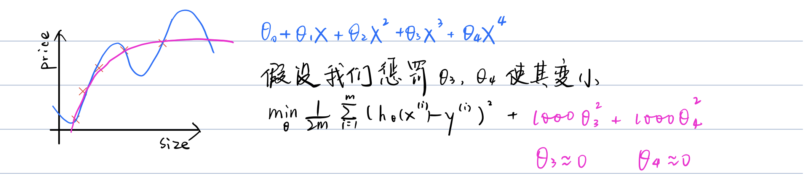

# Cost Function
We can measure the accuracy of our hypothesis function by using a **cost function**(代价函数). 

This takes an average difference (actually a fancier version of an average)
of all the results of the hypothesis with inputs from x's and the actual output y's.

- [[cost-function-for-linear-regression]]
- [[cost-function-for-logistic-regression]]

---

# Cost Function In actual operation

If we have [[the-problem-of-overfitting]] from our hypothesis function, 
we can reduce the weight that some of the terms in our function carry by increasing their cost.

Say we wanted to make the following function more quadratic:

$\theta_{0}+\theta_{1} x+\theta_{2} x^{2}+\theta_{3} x^{3}+\theta_{4} x^{4}$

We'll want to eliminate the influence of $\theta_3x^3$ and $\theta_4x^4$. 

Without actually getting rid of these features or changing the form of our hypothesis, 
we can instead modify our cost function:

$\min _{\theta} \frac{1}{2 m} \sum_{i=1}^{m}\left(h_{\theta}\left(x^{(i)}\right)-y^{(i)}\right)^{2}+1000 \cdot \theta_{3}^{2}+1000 \cdot \theta_{4}^{2}$

We've added two extra terms at the end to inflate the cost of $\theta_3$ and $\theta_4$.

Now, in order for the cost function to get close to zero, we will have to reduce the values of $\theta_3$ and $\theta_4$ to near zero.

This will in turn greatly reduce the values of $\theta_3x^3$ and $\theta_4x^4$ in our hypothesis function. 

As a result, we see that the new hypothesis (depicted by the pink curve) looks like a quadratic function 
but fits the data better due to the extra small terms $\theta_3x^3$ and $\theta_4x^4$.

We could also regularize all of our theta parameters in a single summation as:

$\min _{\theta} \frac{1}{2 m} \sum_{i=1}^{m}\left(h_{\theta}\left(x^{(i)}\right)-y^{(i)}\right)^{2}+\lambda \sum_{j=1}^{n} \theta_{j}^{2}$

The λ, or lambda, is the **regularization parameter**. 

It determines how much the costs of our theta parameters are inflated.

Using the above cost function with the extra summation, 
we can smooth the output of our hypothesis function to reduce overfitting. 

**If lambda is chosen to be too large**, it may smooth out the function too much and cause **underfitting**. 

Hence, what would happen if $\lambda = 0$ or is too small ?

[//begin]: # "Autogenerated link references for markdown compatibility"
[cost-function-for-linear-regression]: cost-function-for-linear-regression "Cost Function for Linear Regression"
[cost-function-for-logistic-regression]: cost-function-for-logistic-regression "Cost Function for Logistic Regression"
[the-problem-of-overfitting]: the-problem-of-overfitting "The Problem of Overfitting"
[//end]: # "Autogenerated link references"