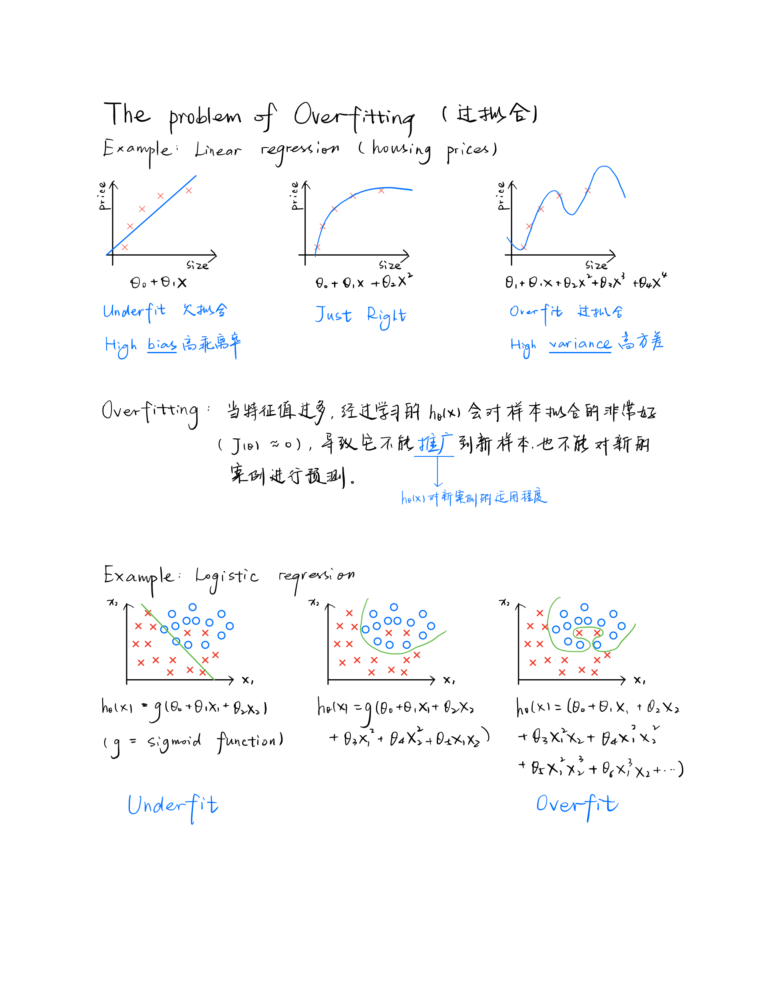

# The Problem of Overfitting

Consider the problem of predicting y from x ∈ R. 

**Underfitting**, or high bias, 
is when the form of our hypothesis function h maps poorly to the trend of the data. 

It is usually caused by a function that is too simple or uses too few features. 

**Overfitting**, or high variance, is caused by a hypothesis function that 
fits the available data but does not generalize well to predict new data. 

It is usually caused by a complicated function that creates a lot of unnecessary curves and angles unrelated to the data.

This terminology is applied to both linear and logistic regression. 

---
There are two main options to address the issue of overfitting:

1) **Reduce the number of features**:

- Manually select which features to keep.

- Use a model selection algorithm (studied later in the course).

2) **Regularization**

- Keep all the features, but reduce the magnitude of parameters $\theta_j$.

- Regularization works well when we have a lot of slightly useful features.

---

- [[cost-function]]

[//begin]: # "Autogenerated link references for markdown compatibility"
[cost-function]: cost-function "Cost Function"
[//end]: # "Autogenerated link references"